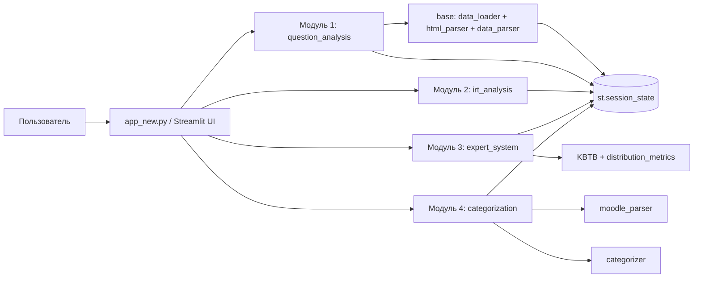

# Архитектура LAppka

## Обзор

LAppka — экспериментальный прототип учебной аналитики для Moodle: сопоставление HTML-статистики с GIFT-банком вопросов, категоризация, расчёт KBTB и рекомендации по доработке банка.

## Структура проекта

```
LAppka/
├── app_new.py              # Главный файл
├── config/
│   └── settings.py         # Настройки, список модулей
├── modules/
│   ├── base/               # Базовый слой
│   │   ├── data_loader.py  # Загрузка HTML
│   │   ├── data_parser.py  # Парсинг и структурирование
│   │   └── html_parser.py  # Парсинг HTML Moodle
│   ├── question_analysis/  # Модуль 1: Анализ вопросов
│   ├── irt_analysis/       # Модуль 2: Сопоставление распределений
│   ├── expert_system/      # Модуль 3: KBTB, рекомендации
│   └── categorization/    # Модуль 4: Категоризация, GIFT
├── utils/                  # helpers.py, constants.py
├── static/                 # CSS, изображения (static/css/, static/images/)
├── data/                   # Тестовые данные (data/test_files/)
└── docs/
```

## Принципы

- **Модульность**: каждый модуль — отдельная функциональность
- **Разделение ответственности**: base — парсинг; модули — анализ, визуализация, экспорт
- **Единый источник данных**: HTML + GIFT загружаются один раз, используются во всех модулях

## Модули

| Модуль | Функции |
|--------|---------|
| **base** | Парсинг HTML (BeautifulSoup), загрузка данных |
| **question_analysis** | Таблица вопросов, метрики, цветовое кодирование по сложности |
| **irt_analysis** | Диаграмма соответствия распределений в логит-шкале, КСС |
| **expert_system** | KBTB, целевые доли L/M/H (связанные слайдеры), рекомендации с количеством |
| **categorization** | Сопоставление с GIFT, категории, экспорт в GIFT с суффиксом (Lappka) |

## Поток данных

1. HTML-отчёт → `html_parser` / `data_loader` → структурированные данные вопросов
2. GIFT → `moodle_parser` → список вопросов банка
3. Сопоставление (SequenceMatcher) → обогащённые данные
4. Категоризация → L/M/H, O/Z, «на переработку»
5. KBTB, рекомендации, визуализация

## Схема взаимодействия модулей прототипа



## Структуры данных для обмена между модулями

| Модуль | Вход | Выход |
|--------|------|-------|
| `question_analysis` | HTML-выгрузка Moodle | `questions_data`, `answers_data` в `session_state` |
| `irt_analysis` | `questions_data` | Диаграмма соответствия распределений, метрики КСС |
| `expert_system` | `questions_data` | KBTB, рекомендации, штрафы |
| `categorization` | GIFT + `questions_data` | Категории 1.1/1.2/2.1/2.2/3 и экспорт GIFT |

## Ограничения текущего подхода

- `st.session_state` используется как штатный механизм Streamlit для хранения состояния между перезапусками скрипта.
- Такой подход уместен для исследовательского прототипа и локальной/малой групповой эксплуатации.
- Для масштабирования и изолированного тестирования вычислительного ядра требуется дальнейшее отделение UI-слоя от прикладной логики и явные интерфейсы обмена данными.

## Добавление модуля

1. Создать `modules/<name>/` с `__init__.py`, `module.py`
2. В `module.py` реализовать `def render():`
3. Добавить в `config/settings.py` (MODULES)
4. Импортировать и добавить в `app_new.py` (tab_functions)
